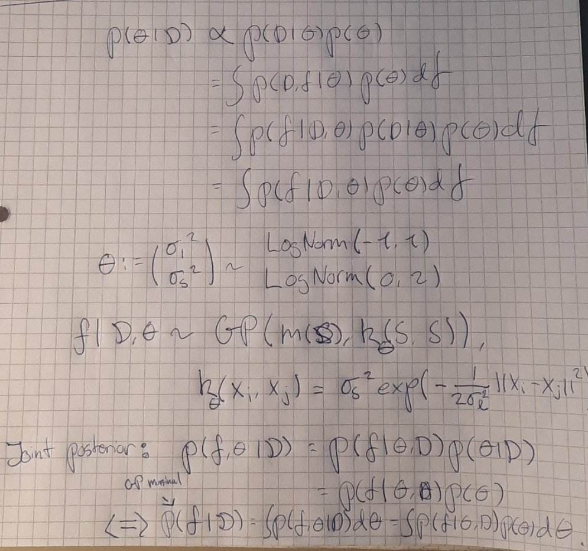
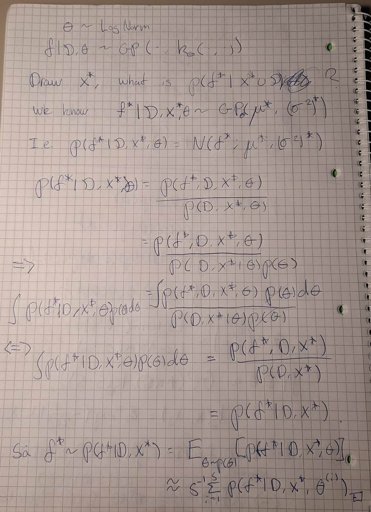
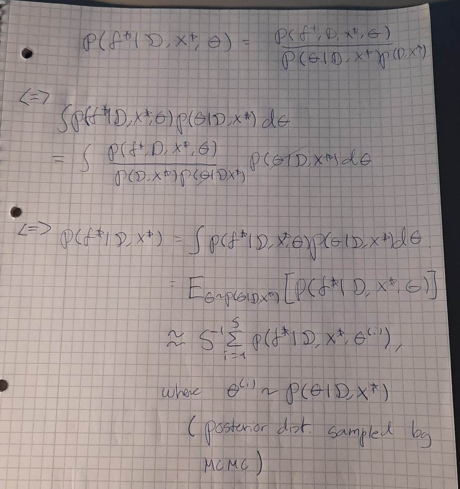

# Questions for the exercise class

- In question B, is it correct that $y_i = f(x_i)$, so $y_i$ is non-stochastic, which implies:
  - $y$ does not have a likelihood function
  - $p(\mathcal{D}) = 1$ (trivially, $\mathcal{D}$ is non-stochastic too while $S = \{-1, -1/2, \ldots, 1\}$)
  - etc.
- Is it correct that we should sample from $p(f^{\star} \mid x^{\star}, \mathcal{D})$ (with $\theta$ deliberately not in the condioning set) i.e. we have to "weight" $\theta$ out as in [this derivation](#predictive-posterior)?
  - Or is $\theta$ in the conditoning set such that we just sample one $\theta^{(i)} \sim p(\theta \mid \mathcal{D})$, insert it into the GP and then construct the posterior predictive?

### Derivations for Gaussian Processes

#### Full Bayesian model

#### Predictive posterior

#### Predictive posterior

#### Average out

